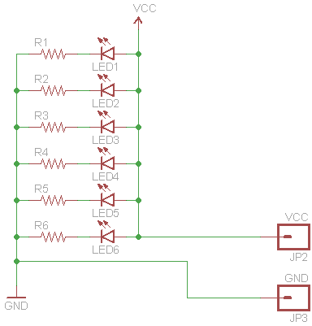
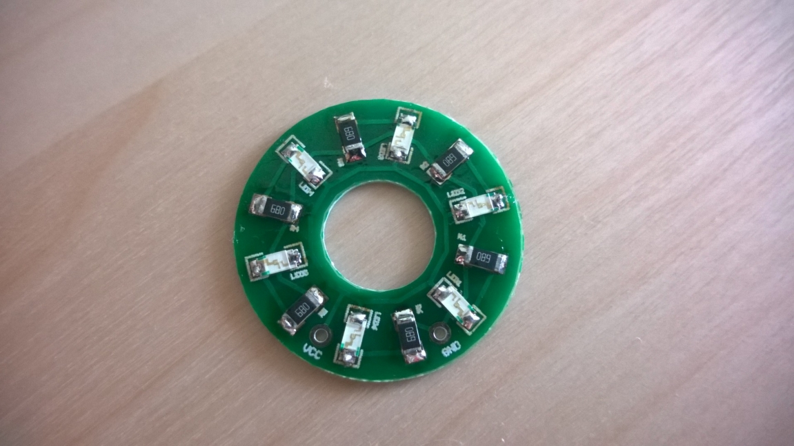

# LED ring

A small ring with 6 leds on it. Outer diameter = 25mm, inner diameter = 9.5mm.

The ring shaped PCB was created with [OpenSCAD](http://www.openscad.org/), saved in .dfx, then converted to .scr with [Micromagic System's DXF2SCR converter](http://www.micromagicsystems.com/#/dxf-converter/4523812840).

## Pictures
Schematic:

Assembled:

